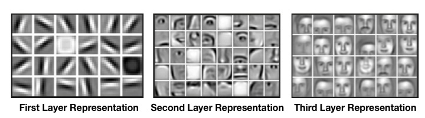

# Deep Dream
Deep Dream is an experimental project by google, for visualising the layers within a deep convolution neural network. Apart from visualising an interesting applications involves transforming images into imaginary stuff.

# Demo

# Understanding the Convolution layers :
Convolution is a mathematical operation performed over the images ( In Convolution Neural Networks ) and the convolution layers learns to extract features like edges , shapes within the image through back propagation . The layers looks something like the image below .

# Deep Dream Approach :
What actually happens in deep dream is the we take pre - trained convolutions neural network ( VGG 16  in our case ) and choose some layers the we want our image to imitate. So our aim is to maximise the output these layers or minimise the negative of these layers . Thus we find the derivative of out loss ( neg of the output of layers taken ) with respect to our input images and apply gradient descent to it .

# References
- [Colah'sBlog](https://web.archive.org/web/20150703064823/http://googleresearch.blogspot.co.uk/2015/06/inceptionism-going-deeper-into-neural.html)
- [Research paper](https://arxiv.org/pdf/1409.4842.pdf)
